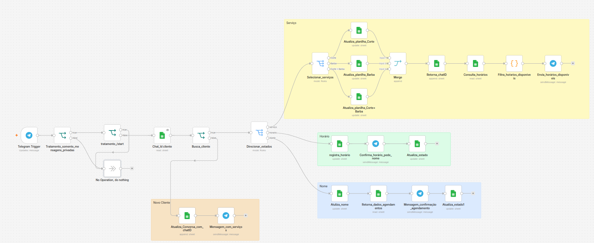

# 🪒 Bot de Agendamento para Barbearia (n8n + Telegram + Google Sheets) --- v1.1

## Workflow



Automação de atendimento e agendamento via Telegram construída em
**n8n**. O cliente interage com um fluxo conversacional baseado em
**máquina de estados**, escolhe um serviço, seleciona um horário
disponível e confirma o agendamento, sem intervenção humana.

## Demonstração

O vídeo completo de funcionamento está disponível em:

- `docs/Barbearia.mp4`

------------------------------------------------------------------------

# 🎯 Objetivo do projeto

Este projeto foi desenvolvido como meu primeiro projeto de portfólio em
automação de processos, com foco em demonstrar:

-   Construção de fluxos no n8n;
-   Integração entre Telegram e Google Sheets;
-   Modelagem de uma máquina de estados;
-   Persistência de contexto sem utilizar banco de dados tradicional;
-   Organização de um fluxo conversacional.

------------------------------------------------------------------------

# 💡 Decisão de projeto

Este bot foi desenvolvido **sem IA generativa**.

Em vez de interpretar linguagem natural, o fluxo utiliza uma máquina de
estados persistida no Google Sheets. Essa abordagem torna o
comportamento totalmente previsível, reduz a complexidade da
implementação e facilita a manutenção.

Como consequência, o usuário é conduzido por etapas bem definidas do
processo de agendamento.

Essa foi uma decisão consciente de arquitetura para a primeira versão do
projeto.

------------------------------------------------------------------------

# 🧠 Como funciona

1.  O Telegram Trigger recebe uma mensagem.
2.  O fluxo aceita apenas **mensagens privadas**. Mensagens vindas de
    grupos são descartadas.
3.  O comando **/start** é tratado separadamente e **não faz parte do
    fluxo de agendamento**.
4.  O sistema verifica se o Chat ID já existe na planilha.
5.  Se for um novo cliente, cria um registro na aba **Conversas**.
6.  Dependendo do estado salvo na planilha, o Switch direciona o cliente
    para a próxima etapa.
7.  Ao final do processo, o estado é atualizado para **confirmado**,
    encerrando o fluxo.

------------------------------------------------------------------------

# 🔄 Máquina de estados

``` text
Novo Cliente
      │
      ▼
aguardando_serviço
      │
      ▼
aguardando_horario
      │
      ▼
aguardando_nome
      │
      ▼
confirmado
```

Toda a conversa é controlada pelo campo **Estado** armazenado na
planilha Google Sheets.

------------------------------------------------------------------------

# 🚦 Tratamentos implementados

## Apenas mensagens privadas

Antes de qualquer processamento, o workflow verifica:

    chat.type == "private"

Caso a mensagem venha de um grupo ou canal, ela é ignorada utilizando um
nó **No Operation**.

Isso evita que o bot execute o fluxo em grupos do Telegram.

------------------------------------------------------------------------

## Tratamento do comando `/start`

O comando `/start` é utilizado apenas para iniciar o bot no Telegram.

Ele **não representa uma resposta válida do usuário**.

Por isso, quando o bot recebe `/start`:

-   nenhum estado é alterado;
-   nenhum registro é criado;
-   nenhuma etapa do agendamento é iniciada.

O comando é simplesmente ignorado pelo fluxo principal.

O atendimento começa somente quando o usuário envia sua primeira
mensagem.

------------------------------------------------------------------------

# 📁 Persistência

O Google Sheets funciona como um banco de dados simples.

## Conversas

-   Chat_id
-   Estado
-   Serviço
-   Última atualização

## Agendamentos

-   Nome
-   Serviço
-   Data
-   Horário
-   Status

------------------------------------------------------------------------

# 🛠️ Tecnologias

-   n8n
-   Telegram Bot API
-   Google Sheets

------------------------------------------------------------------------

# ⚠️ Limitações da versão 1.1

Esta versão foi projetada para ser simples e previsível.

Por isso:

-   não utiliza IA;
-   não interpreta linguagem natural;
-   não responde perguntas livres como "Onde vocês ficam?" ou "Qual o
    preço?";
-   trabalha com uma única conversa estruturada por cliente;
-   após o agendamento, o estado passa para **confirmado**, encerrando o
    fluxo atual.

Essas limitações foram aceitas para manter o projeto simples e
demonstrar conceitos fundamentais de automação.

------------------------------------------------------------------------

# 🚀 Próximas melhorias

-   Cancelamento e reagendamento;
-   Validação mais robusta das entradas;
-   Persistência em PostgreSQL ou Supabase;
-   Integração com calendário;
-   Evolução para um agente com IA mantendo regras de segurança.

------------------------------------------------------------------------

# 👤 Autor

Desenvolvido por **Gustavo Franzi** como primeiro projeto de portfólio
utilizando n8n.
